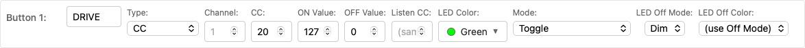
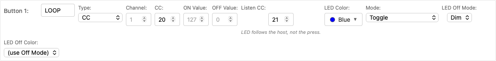
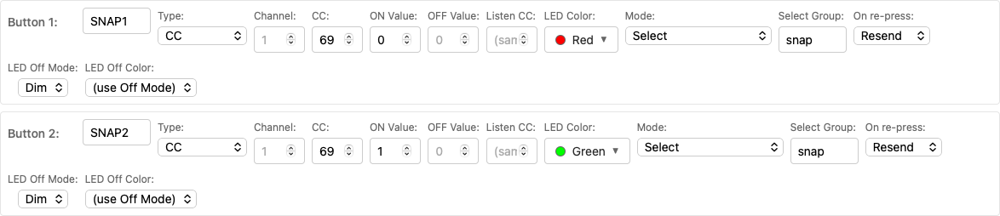
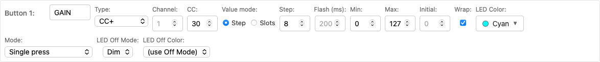

# Inbound MIDI: Host-to-Device Button Sync

The stock MIDI Captain firmware is send-only: the pedal talks, nothing talks back. MCM is bidirectional. Your host — Helix, Ableton, MainStage, a lighting rig, anything that can send MIDI — can drive the pedal's LEDs and button state, so what you see on the floor always matches what's actually happening in the rig.

This page covers the three ways a button reacts to incoming MIDI. Two related features, [MIDI-IN page switching](./page-control.md) and the [MIDI routing matrix](./midi-thru.md), are documented separately.

## The basics

- MCM listens on **USB** and **5-pin DIN** at the same time. (Unless you've made an input forward-only in the [routing matrix](./midi-thru.md).)
- A message reaches a button when the **type**, **number** and **channel** all match that button's settings. Channels match exactly — a button on channel 1 ignores the same CC on channel 2.
- Only buttons on the **active page** react.
- Receiving is **LED-and-state-only**. An inbound message never makes the pedal send MIDI back, so you can safely wire your host to echo every change to the pedal — no feedback loops.
- Every message that lands shows briefly on the LCD status line (e.g. `RX CC69=2`), so you can verify your wiring without a MIDI monitor.

## Mode 1: State sync

Any **CC** or **Note** button that isn't in Select mode simply follows the host: whatever it says, the button becomes.

For CC buttons the incoming value is checked against **ON Value** and **OFF Value**. Anything else falls back to the classic MIDI convention — above 63 is on, 63 or below is off — so hosts that only send 0 and 127 keep working even if you've customized those fields.

Note buttons turn on for a NoteOn with velocity above zero, and off for a NoteOff or a NoteOn at velocity 0.

If two non-Select buttons share the same CC and channel, the **first one in the list wins** — scan order runs top-left to bottom-right.

### Scenario: Ableton track-arm feedback

Button 3 sends CC 20 to toggle a device. Map Ableton to also *send* CC 20 when the device state changes. Now toggling it from your laptop, a push controller or automation lights up button 3 correctly — the pedal never goes stale.

### Scenario: Gig Performer 2-way sync

Button 3 sends CC 20 to toggle a widget. In Gig Performer's *Edit* mode, select the widget, open the MIDI tab in Widget Properties, and choose the **Sync** behavior:

Gig Performer now sends CC 20 back whenever the widget changes, and the pedal follows.

### Listen CC: send on one CC, listen on another

Some hosts take commands on one CC and report state on a different one — a looper's play/stop trigger versus its is-playing indicator. Fill in **Listen CC** and the button sends on its own CC but takes its state from that one instead.

Two things change when you set it:

- **The host owns the LED.** A press still sends MIDI, but only the host's reply lights the button. Foot and host can never disagree.
- **"Sharing a CC" now means sharing the Listen CC.** Everything below — Select matching, shielding, scan order — goes by the number the button listens on.

Listen CC is for CC buttons; Note buttons have no equivalent.

## Mode 2: Select sync (radio groups)

Buttons set to **Mode: Select** with the same **Select Group** behave as a radio group: one is active, the rest are dim. Inbound MIDI drives the same behavior from the host side.

A Select button activates **only on an exact ON Value match**. Near-misses are ignored on purpose, so a stray value can't falsely flip your active snapshot. That's what lets several Select buttons share one CC number and differ only by ON Value:

### Scenario: Helix snapshots

Four buttons, all on CC 69, ON Values 0 / 1 / 2 / 3, all in the same Select Group. When the Helix changes snapshot — from its own footswitches, a preset load, or automation — it sends CC 69 back out, the matching button lights, and its siblings dim. The pedal always shows the true active snapshot.

### Shielding: keep a select group's CC to itself

Once a Select button claims a CC number, plain buttons further down the list are **shielded** from it: a value that matches no ON Value is swallowed rather than being misread as a generic on/off by the above-63 rule. The status line still logs the message; nothing changes state.

Shielding only protects buttons that come **after** the select group in the list. So if a plain button shares a CC with a select group, put the **group first** — otherwise the plain button is simply the first match and flips on values meant for the group.

### On re-press

The **On re-press** setting (Resend / Nothing / Deselect) applies to physical presses only. Inbound activation is idempotent: the same message twice just confirms the LED, sends nothing, deselects nothing.

## Mode 3: CC+ / CC- buttons

A **CC+** or **CC-** button steps a shared value up or down on each press. Over MIDI, the host simply sets that value: send its CC with any value and that becomes the new value, clamped to the button's Min and Max.

No ON Value check, no above-63 rule, no shielding — every value is accepted. The LED and label repaint only when the value actually changes (in Slots mode, when the slot changes).

Don't put a plain CC button on the same CC and channel: the CC+ / CC- button claims it first.

Keytimes buttons don't react to inbound MIDI at all, unless they carry CC+ / CC- settings — then they behave like this.

## Quick reference

| | State sync | Select sync | CC+ / CC- |
|---|---|---|---|
| Applies to | CC or Note, not Select | CC or PC set to **Select** | CC+ / CC- |
| Reacts to | ON Value / OFF Value, else above-63 | exact ON Value (CC) or program (PC) | any value |
| Other values | flip via the above-63 rule | ignored (shielded) | n/a |
| Effect | that button on/off | activate it, dim its group | sets the shared value |
| Sends MIDI back? | never | never | never |
