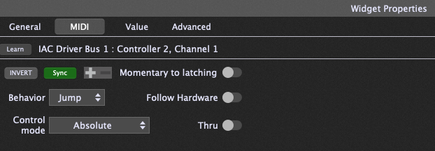

# Inbound MIDI: Host-to-Device Button Sync

The stock MIDI Captain firmware is send-only: the pedal talks, nothing talks back. MCM is bidirectional. Your host — Helix, Ableton, MainStage, a lighting rig, anything that can send MIDI — can drive the pedal's LEDs and button state, so what you see on the floor always matches what's actually happening in the rig.

This document covers the two per-button receive modes: **state sync** and **select sync**. Two related inbound features — [MIDI-IN page switching](./page-control.md) and the [MIDI THRU routing matrix](./midi-thru.md) — are documented separately.

## How messages arrive

MCM listens on both inputs simultaneously:

- **USB MIDI** — messages from the connected host
- **5-pin DIN MIDI IN** — messages from other hardware

Both feed the same processing. A message matches a button when the message type, number, and channel all line up with that button's config:

| Button type | Matches on |
|---|---|
| `cc` | CC number + channel |
| `note` | Note number + channel |
| `pc` | Program number + channel (select mode only) |

Channels are matched exactly. A button configured for channel 1 ignores the same CC on channel 2. (Config files use 0-indexed channels; the editor displays 1–16.)

Receiving is **LED-and-state-only**: an inbound message updates the pedal's display and internal state but never causes the pedal to re-send MIDI. There is no feedback-loop risk — you can safely wire your host to echo every change back to the pedal.

Only buttons on the **active page** react to inbound messages.

## Mode 1: State sync (toggle, momentary, and friends)

Any non-select `cc` or `note` button tracks inbound messages as a **host override**: whatever the host says, the button becomes.

### CC buttons

The incoming value is checked against the button's configured `cc_on` and `cc_off`:

1. Value equals `cc_on` (default 127) → button turns **on**
2. Value equals `cc_off` (default 0) → button turns **off**
3. Anything else → falls back to the classic MIDI convention: **value > 63 = on, ≤ 63 = off**

The fallback means hosts that send generic 0/127 keep working even if you've customized `cc_on`/`cc_off` to other values. Because `cc_on` is checked first, setting `cc_on == cc_off` would make the button impossible to turn off via that value — the firmware warns about this at boot.

If several non-select buttons share the same CC and channel, the **first matching button in scan order** (top-left to bottom-right, by button index) receives the update. When a select-mode button shares that CC too, which button actually reacts depends on scan order in a different way — see [Shielding](#shielding) below.

### Note buttons

- **NoteOn** with velocity > 0 → button on
- **NoteOn** with velocity 0, or **NoteOff** → button off

### Example: Ableton track-arm feedback

Button 3 sends CC 20 to toggle an Ableton device. Map Ableton to also *send* CC 20 back out when the device state changes (via the same MIDI mapping or a Max for Live feedback patch). Now toggling the device from your laptop, a push controller, or automation lights up button 3 correctly — the pedal never goes stale.

### Example: Gig Performer 2-Way sync

Button 3 sends CC 20 to toggle a widget in Gig Performer. In Gig Performer's _Edit_ mode, select the widget and go to the MIDI tab in the Widget Properties pane. 



Click to select the `Sync` behavior. This maps Gig Performer to also *send* CC 20 back out when you click the widget in GP. 

Now toggling the device from your laptop, a push controller, or automation lights up button 3 correctly — the pedal never goes stale.

## Mode 2: Select sync (radio groups)

Buttons with `mode: "select"` behave as a radio group locally — pressing one activates it and dims its `select_group` siblings. Inbound MIDI can drive the same behavior from the host side.

### CC select buttons

A select button activates **only on an exact `cc_on` match**. Near-misses are deliberately ignored — a stray value can't falsely flip your active snapshot.

Several select buttons may share one CC number and differ only by `cc_on`. This is exactly how Helix snapshots work:

```jsonc
// Four buttons, all CC 69, one per snapshot
{ "type": "cc", "cc": 69, "cc_on": 0, "mode": "select", "select_group": "snap", "label": "SNAP1" },
{ "type": "cc", "cc": 69, "cc_on": 1, "mode": "select", "select_group": "snap", "label": "SNAP2" },
{ "type": "cc", "cc": 69, "cc_on": 2, "mode": "select", "select_group": "snap", "label": "SNAP3" },
{ "type": "cc", "cc": 69, "cc_on": 3, "mode": "select", "select_group": "snap", "label": "SNAP4" }
```

When the Helix changes snapshots (from its own footswitches, a preset load, or automation) and sends CC 69 back out, the matching button lights and its siblings dim. The pedal always shows the true active snapshot.

### Shielding

Once a select button claims a CC number, non-select buttons on that same CC are **shielded** from it. Without this, an inbound CC 69 = 2 would match no select button's `cc_on` exactly, fall through to a plain toggle button on CC 69, and spuriously flip it via the >63 fallback. Values that match a select-claimed CC but no `cc_on` are consumed silently — no state change anywhere.

**What "shielded" means:** the message is dropped with zero effect on that button — no LED change, no state flip. It just stays exactly as it was. The button isn't disabled generally; its own CC still works normally, and physical presses are unaffected. It's only non-matching *inbound* values on this shared CC that get eaten instead of being misread as a generic on/off via the >63 fallback. The status line still logs the raw message (e.g. `RX CC69=2`) — you're just seeing that the message arrived, not that anything happened as a result.

**Shielding only protects buttons later in scan order.** Matching runs top-left to bottom-right, same as state sync above, and a select button can only shield the non-select buttons it reaches *after* itself in that scan. A non-select button positioned *before* the select group on the same CC is never shielded — it's simply the first match, wins outright under the ordinary state-sync rule, and applies the >63 fallback like any other toggle button. If you want a select group to reliably own a CC number, put every button in that group ahead of any other button using that CC — earlier in the buttons list, which on real hardware means earlier in the physical scan order.

**Example** — the CC 69 Helix snapshot group from above, sharing the pedal with an unrelated MUTE toggle also wired to CC 69:

Protected — select group listed first:

```jsonc
{ "type": "cc", "cc": 69, "cc_on": 0, "mode": "select", "select_group": "snap", "label": "SNAP1" },
{ "type": "cc", "cc": 69, "cc_on": 1, "mode": "select", "select_group": "snap", "label": "SNAP2" },
{ "type": "cc", "cc": 69, "mode": "toggle", "label": "MUTE" }
```

An inbound `CC69=5` matches neither SNAP1's nor SNAP2's `cc_on`, so the scan passes over both, marks the CC claimed, then reaches MUTE and shields it. MUTE holds its state. Only `CC69=0` or `CC69=1` does anything.

Unprotected — same three buttons, MUTE listed first:

```jsonc
{ "type": "cc", "cc": 69, "mode": "toggle", "label": "MUTE" },
{ "type": "cc", "cc": 69, "cc_on": 0, "mode": "select", "select_group": "snap", "label": "SNAP1" },
{ "type": "cc", "cc": 69, "cc_on": 1, "mode": "select", "select_group": "snap", "label": "SNAP2" }
```

Now MUTE is the first match, full stop — the scan never even reaches SNAP1 or SNAP2. An inbound `CC69=5` flips MUTE on via the >63 fallback, exactly the spurious-toggle case shielding exists to prevent. Same three buttons, same CC — only the list order changed.

### PC select buttons

Select buttons of type `pc` activate on an exact **program number** match on their channel. If your amp modeler sends Program Change when presets load, a row of PC select buttons stays in sync with the current preset no matter how it was changed.

### `select_repress` and inbound MIDI

The `select_repress` setting (`resend` / `nothing` / `deselect`) applies **only to physical presses**. Inbound activation is idempotent: receiving the same message twice just confirms the LED state, sends nothing, and deselects nothing.

## Status line

Every handled inbound message briefly shows on the LCD status line (e.g. `RX CC69=2`), which makes wiring up host feedback easy to verify without a MIDI monitor.

## Quick reference

| | State sync | Select sync |
|---|---|---|
| Applies to | `cc` (non-select), `note` | `cc` / `pc` with `mode: "select"` |
| Match rule | exact `cc_on`/`cc_off`, else >63 fallback | exact `cc_on` (CC) or program (PC) only |
| Non-matching values | flip via >63 fallback | ignored (shielded) |
| Effect | that button on/off | activate button, dim group siblings |
| Sends MIDI back? | never | never |
