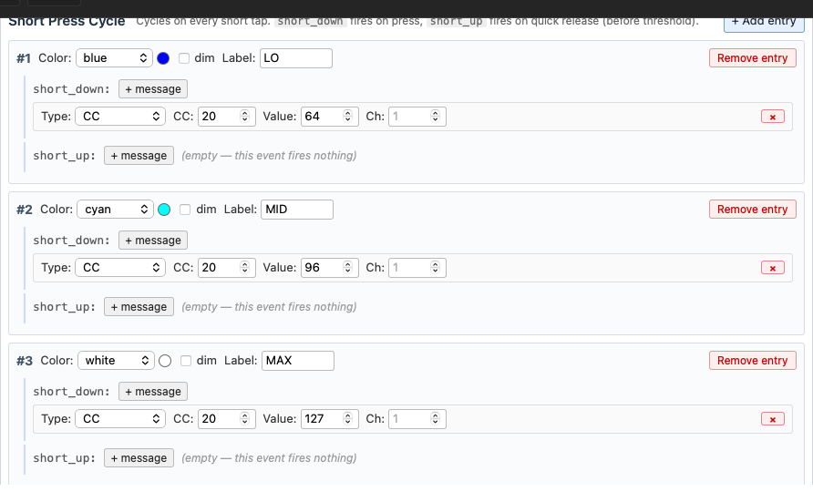
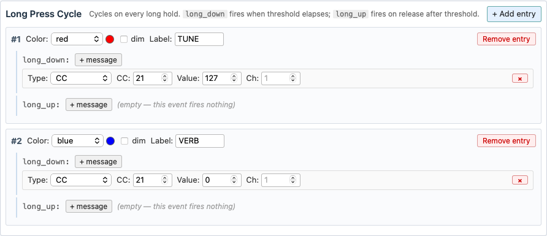

# Keytimes: One Button, Several Jobs

Keytimes turns one footswitch into several. Each tap steps the button to its next state — its own message, its own LED color, its own screen label — and **holds get a completely separate cycle**. One switch can tap through three reverb levels *and* hold for a tuner.

This is the MIDI Captain MAX answer to the OEM SuperMode behavior, with per-state control over everything the button does.

## Setting one up

In the Config Editor, set the button's **Mode** to **Keytimes (short/long)**. Two sections appear — **Short Press Cycle** and **Long Press Cycle** — each with an **+ Add entry** button. Every entry is one state of the button.

You don't have to use both. A button with only short entries is a plain multi-state tap button; one with only long entries does nothing until you hold it.

## Taps: the short press cycle

Each tap fires the next entry and wraps around at the end. Above: tap for 50% wet, tap for 75%, tap for 100%, tap back to 50% — with the LED going blue, cyan, white and the screen showing LO, MID, MAX.

Per entry you get:

| Field | What it does |
|---|---|
| **Color** | LED color for this state. Leave it on `(inherit)` to use the button's own color, or pick `off` to go dark |
| **dim** | render that color at low brightness |
| **Label** | screen text for this state (6 characters max). Blank inherits the button's label |
| **short_down** | messages fired the instant you press |
| **short_up** | messages fired when you release (before the hold threshold) |

**An empty slot does nothing at all** — no MIDI, no LED change, and the cycle does not advance. That's deliberate: it's what lets you build a hold-only button that taps can't disturb.

## Holds: the long press cycle

Holds work the same way on their own counter: **long_down** fires the moment you cross the hold threshold (while still holding), **long_up** fires when you let go.

Tapping never moves the long cycle, and holding never moves the short one — with one exception, below.

## The one gotcha: a hold also fires `short_down`

Pressing the switch fires `short_down` immediately, every time — including at the start of a hold. So if your short entries put their messages in **short_down**, holding the switch fires them too, and steps the short cycle along with it.

If you want taps and holds to stay fully independent, **put the short messages in `short_up` instead**. That slot only fires on a release *before* the threshold, so a hold never touches the short cycle. The tradeoff: the message goes out when you lift your foot rather than when you press.

Use `short_down` when you want instant response and don't mind holds advancing the taps too.

## Hold threshold and color behavior

**Long-press threshold (ms)** is the tap/hold boundary for this button. Leave it blank to use the global default of 500 ms. Raise it if you're triggering holds by accident mid-song; lower it if holds feel sluggish.

**Long-press color overrides short-press color** changes what the LED shows. Off (the default), the LED reflects whichever you did most recently — tap and you see the tap color, hold and you see the hold color. On, the hold color sticks while you keep tapping, which is what you want when a hold turns on a *mode* you need to stay visible.

## What the LED and screen show

Normally the last press wins, and colors resolve in this order:

1. A short entry set to **off** turns the LED dark — it beats everything, so `off` works as a kill switch.
2. Otherwise a hold color, if the entry sets one.
3. Otherwise a tap color.
4. Otherwise the button's own **LED Color**.

The screen label follows the same last-press-wins rule, falling back to the button's label when an entry doesn't set one. A button's **LED Off Color** is ignored in keytimes mode — the cycle entries own the LED.

## What an entry can send

Each slot takes any message the editor offers: **CC**, **Note**, **PC Fixed**, **PC+** / **PC-**, **CC+** / **CC-**, **HID** (keyboard/mouse), and **Page+** / **Page-** / **Page Jump**. One entry can hold several messages — click **+ message** again.

Two worth calling out:

- **CC+ / CC-** entries only pick a direction. The CC number, range, step size and slot names are set once on the button and shared by every entry, so one switch can tap the value up and hold to take it back down.
- **Page+ / Page- / Page Jump** in a long entry is the usual way to put page switching on a hold while taps do something musical.

## Pages reset the cycles

Switching pages puts every keytimes button on the incoming page **back at entry #1**, showing the button's own color and label until its first press. Shared CC+ / CC- values and PC patch memory are *not* reset.

## Scenarios

**Three reverb levels, taps only.** Three short entries, each a CC with a different value, each its own color and label. No long entries — holding does nothing.

**Tap to toggle, hold for the tuner.** Two short entries in `short_up` (on and off, the off one with Color `off` so the LED goes dark), and two long entries toggling your tuner CC in red. Because the taps live in `short_up`, holding for the tuner never disturbs the toggle.

**Hold to change page.** One short entry sending your normal message, one long entry with a **Page+** message. A quick tap plays; a hold moves to the next page.

**A mode that stays lit.** Tick **Long-press color overrides short-press color**, give the long entry a distinct color and label, and it stays on screen while you keep tapping the short cycle underneath it.
