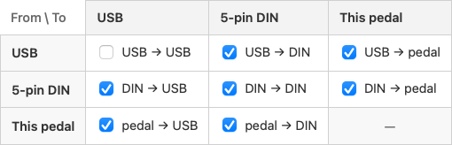
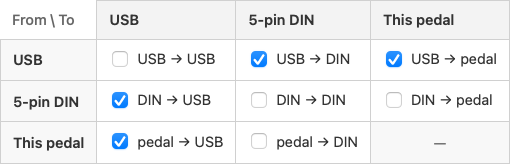

# MIDI Routing Matrix

MCM routes MIDI between three places: its **USB** port, its **5-pin DIN** port, and **the pedal itself**. Every path is its own on/off switch, so the pedal can sit anywhere in a MIDI chain without you having to choose one connection or the other.

In the Config Editor it's the **MIDI Routing** pane — rows are where a message comes from, columns are where it goes:

## What each route does

| Route | On by default | What it's for |
|---|---|---|
| **USB → DIN** | yes | Send your computer's MIDI out to gear on the 5-pin chain |
| **DIN → USB** | yes | Let a foot controller or keyboard upstream reach your computer through the pedal |
| **DIN → DIN** | yes | Classic MIDI THRU — daisy-chain other 5-pin gear downstream |
| **USB → USB** | **no** | Echo the computer's own MIDI back to it. Niche; see the warning below |
| **pedal → USB** | yes | Send this pedal's own button, encoder and expression messages out USB |
| **pedal → DIN** | yes | Same, out the 5-pin DIN port |
| **USB → pedal** | yes | Act on what arrives on USB — match buttons, light LEDs, track select groups |
| **DIN → pedal** | yes | Same, for the 5-pin DIN input |

Turning an input's **→ pedal** route off makes that port **forward-only**: messages still pass through, the pedal just stops reacting to them. The pedal → pedal corner isn't a route — a pedal routing to itself is just the button doing its job.

## Order of events

For every message that arrives, the pedal does two independent things:

1. **Acts on it** — if that port's → pedal route is on. This is where [button sync](./inbound-midi.md) and [page control](./page-control.md) happen.
2. **Forwards it** — on whichever thru routes are on, keeping the original channel.

Neither gates the other. A message the pedal ignores is still forwarded, and turning thru routes off never stops the pedal reacting to what it receives.

## Scenario: pedal in the middle of a chain

A synth's MIDI out feeds the pedal's DIN in, the pedal's USB feeds your computer, and you want the computer to drive a drum machine on the DIN out.

Leave **DIN → USB** and **USB → DIN** on, and turn **DIN → DIN** off — there's no need to send the synth back out its own chain. The pedal is now transparent in both directions while still reading everything for its own buttons.

## Scenario: a ring of Captains

Daisy-chaining Captains over DIN is one-way, so only the USB-connected pedal ever hears the computer. Closing the chain into a **ring** — the last pedal's DIN out looping back into the first pedal's DIN in — fixes that: messages travel all the way around and reach every pedal.

The catch is at the pedal that closes the ring, the one whose DIN out starts the chain and whose DIN in receives the tail of it. Left alone, its own messages lap the ring and come back to its input, where **DIN → USB** sends them to the computer a second time — and messages it already handled over USB get processed again on the way past.

On that pedal only, turn off three routes:

- **DIN → DIN** — so messages don't circulate the ring forever
- **pedal → DIN** — so its own messages never enter the ring
- **DIN → pedal** — so it doesn't re-handle what it already did over USB

Leave **DIN → USB** on: that's what carries the other pedals' messages to the computer. Every other pedal in the ring keeps its defaults.

## Warnings you might see

- **"This pedal's switches send nothing"** — both pedal → outputs are off, so button, encoder and expression messages go nowhere.
- **"This pedal ignores all incoming MIDI"** — both → pedal routes are off, so nothing matches buttons or tracks select groups. Thru still passes messages along.

Neither blocks saving. They're legitimate settings for a send-only or forward-only node in a bigger rig — the editor just makes sure you meant it.

## A note on USB → USB

Leave it off unless you specifically need it. It echoes the computer's own MIDI straight back to the computer, so if your DAW also has MIDI echo or thru enabled, the two echoes compound into duplicate or stuck notes.
