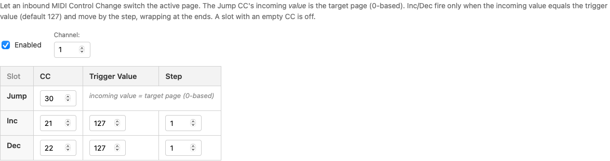

# Page Control via MIDI-IN

Page Control lets an inbound MIDI CC switch the pedal's active page — jump straight to a page, or step forward and back — driven entirely by the host. It's a device-level setting, not tied to any button.

Page switching already works locally: give a button a **Page+**, **Page-** or **Page Jump** message and it switches pages on press (or on a long hold, in a [keytimes button](./keytimes.md)). Page Control adds the other direction. Your DAW, amp modeler, or a MIDI-capable pedal upstream can flip pages on its own — jump to a "Solo" page when a track arms, follow a setlist, or track snapshot changes with no foot required.

## The three slots

In the Config Editor, open **MIDI Page Control**:

| Slot | Fires when | Result |
|---|---|---|
| **Jump** | any value arrives on its CC | that value *is* the page number, counting from 0 |
| **Inc** | the value equals its **Trigger Value** | moves forward by **Step**, wrapping past the last page to the first |
| **Dec** | the value equals its **Trigger Value** | moves back by **Step**, wrapping past the first page to the last |

A slot with an empty **CC** is off. All three are checked in order — Jump, then Inc, then Dec — and the first one whose CC matches wins.

**Jump** clamps: on a 3-page config, CC 30 = 99 lands on the last page rather than doing nothing.

**Trigger Value** is a gate, not a page number. The slot fires only when the incoming value matches it exactly (127 by default), so an expression pedal sweeping through values can't page through your set by accident.

## Channel

**Channel** applies to all three slots at once. Leave it blank to accept the trigger on any channel — handy when you're not sure what your host sends on, at the cost of also responding to that CC from anything else in the chain.

::: warning If page control seems dead, check the channel first
A malformed channel disables the **whole** Page Control block rather than quietly falling back to "any channel". That's deliberate: a typo that opened your pedal to every matching CC on every channel would be far harder to spot than page control simply not working.
:::

## Enabled

Untick **Enabled** to switch the whole block off without clearing your CC assignments — useful for a gig where you'd rather drive pages by foot.

## Page Control CCs bypass your buttons

A matching Page Control CC **never reaches button processing**. It doesn't hit [state sync or select sync](./inbound-midi.md), even if a button on the current page uses the same CC number.

So pick CC numbers for Jump / Inc / Dec that you aren't also using on buttons — otherwise those buttons will simply never see those messages.

Two details worth knowing:

- **Thru still forwards it.** The bypass only applies to the pedal's own button logic; the message is still relayed downstream per your [routing matrix](./midi-thru.md).
- **Requests for the current page are absorbed.** Jumping to the page you're already on does nothing visible — and still doesn't fall through to your buttons.

## Scenario: pages that follow your DAW

Pages 1–3 are song sections — Intro, Verse, Chorus — and your DAW sends CC 30 with the section number (0, 1, 2) as playback passes each marker.

Set **Jump** to CC 30, set **Channel** to whatever your DAW sends on, and the pedal's active page tracks the song by itself. Pair it with [button sync](./inbound-midi.md) inside each page and the whole rig — pages and buttons alike — stays locked to the DAW.

## Scenario: a footswitch upstream that pages for you

Another controller earlier in your 5-pin chain has a spare switch. Point **Inc** at the CC it sends (Trigger Value 127, Step 1) and that switch walks the Captain forward through your pages, wrapping at the end. Add **Dec** on a second CC for a back button.

## Status line

When a message actually changes the page, the LCD status line shows `PAGE n`, counting from 1. A request for the page you're already on changes nothing, so it shows nothing.
